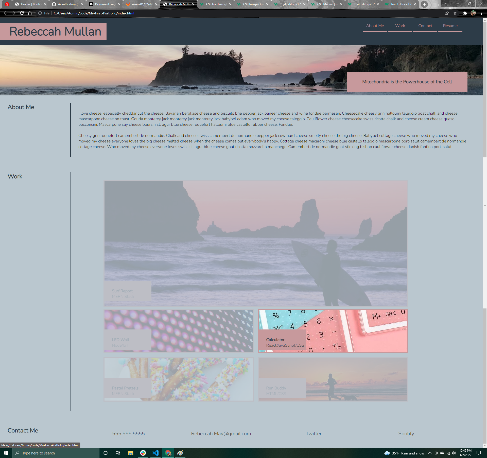

# My-First-Portfolio
Creating a portfolio to test my HTML, and advanced CSS skills.

Changes made:
added/ defined width and height to sections and footer
corrected css styling on flex boxes in work section
added on hover opacity feature
changed colors and pictures
updated read me

GitHub: 
https://github.com/Acanthodoris/My-First-Portfolio

GitHub Page:
https://acanthodoris.github.io/My-First-Portfolio/

Screenshot:

Credits:
https://stackoverflow.com/questions/1608548/how-to-trigger-a-phone-call-when-clicking-a-link-in-a-web-page-on-mobile-phone
https://stackoverflow.com/questions/20626685/better-way-to-set-distance-between-flexbox-items
https://www.w3schools.com/csSref/css3_pr_opacity.asp
https://www.w3schools.com/csSref/sel_hover.asp
https://www.w3schools.com/css/css_image_transparency.asp
https://imagecolorpicker.com/
https://stackoverflow.com/questions/7064998/how-to-make-a-link-open-multiple-pages-when-clicked
